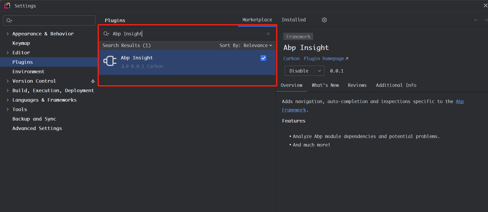

***This project is in early stage, only a few features has been implemented. If you have any suggestions, please feel
free to put forward your ideas or submit PR***

## Introduce

Abp Insight is a Rider plugin for [Abp framework](https://github.com/abpframework/abp). We know that Rider is a very
powerful IDE for .NET, and is famous for its intelligence. Now it can be smarter when developing Abp application.

## How to install

Open `Setttings` -> `Plugins`, switch to `Marketplace` tab, search "Abp Insight" and install it.

## How to run

- Open the gradle project in rider directory with Intellij IDEA.
- Open the AbpInsight.sln in resharper directory with Rider.
- Execute `runIde` gradle task in Intellij IDEA, it will start a new Rider instance with the developing plugin installed.
- Start a debug session by click `Run -> Attach to Process` in Rider, select the corresponding process, then you can debug the source code as normal.

## Features

- [ ] Integrate `ApplicationService` with Rider endpoints explorer.

- ### Navigation

    - [x] Navigate to Abp module dependencies.
    - [x] Navigate to service declarations in Abp module.

- ### QuickFix
    - [x] Incorrect Abp module naming (Abp module name should end with 'Module').

- ### Templates
    - [x] Abp widget class.

