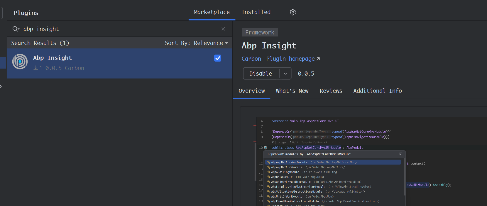

***This project is in early stage, only a few features has been implemented. If you have any suggestions, please feel
free to put forward your ideas or submit PR***

# Introduce

Abp Insight is a Rider plugin for [Abp framework](https://github.com/abpframework/abp). We know that Rider is a very
powerful IDE for .NET, and is famous for its intelligence. Now it can be smarter when developing Abp application.

### How to install

Open `Setttings` -> `Plugins`, switch to `Marketplace` tab, search "Abp Insight" and install it.

### Expected features

...

